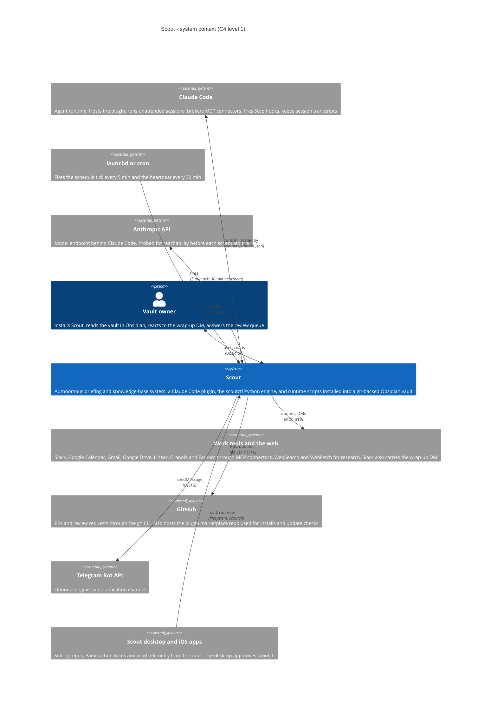

# Level 1 — System context

Scout, the people and systems around it, and what crosses each boundary.
Everything inside the single `Scout` box is unpacked in
[02-containers.md](02-containers.md). The seven work tools are drawn as one
box here because they are reached one way, through the MCP connectors that
Claude Code already has; the plugin component view lists them individually.

## Reading the diagram

- **What flows to the owner.** The vault itself, browsed in Obsidian or any
  editor, carries the action items and knowledge base. A Slack DM at the end of
  every run carries the summary. Reactions and thread replies on that DM, plus
  inline `//==<< comment >>==//` markers anywhere in the vault, are the feedback
  the dreaming session processes. The owner drives Scout with slash commands
  and skills inside Claude Code.
- **Scout never holds credentials for the work tools.** Every Slack, Calendar,
  Gmail, Drive, Linear, Granola and Fathom call is an MCP tool call made by a
  Claude Code session; the connectors are whatever the host already has. GitHub
  is the exception: sessions and the engine use the `gh` CLI, never a GitHub MCP.
  Linear is the only tool Scout writes back to.
- **Two things come from GitHub.** Sessions read PRs and review requests with
  `gh`. Separately, the plugin is installed from the marketplace repo and
  `scoutctl self-update check` reads the raw `marketplace.json` on `main`.
- **Telegram is engine-only.** `scoutctl notify telegram` exists and is
  registered as a connector, but no assembled prompt calls it. The prompt-side
  notification path is Slack.
- **The companion apps are readers.** The macOS and iOS apps parse the same
  action-item markdown (a byte-identical parser corpus is vendored in all three
  repos) and read `session-tokens.jsonl`; the desktop app can also run
  `scoutctl schedule fire-now` and `scoutctl schedule list --json`.
- **Not drawn:** two connectors listed in the engine registry that have no phase
  module or probe yet (Google Messages through the Claude-in-Chrome extension,
  and a local WhatsApp bridge). They cannot be exercised by an assembled prompt
  today, so they are omitted rather than shown as live edges.
