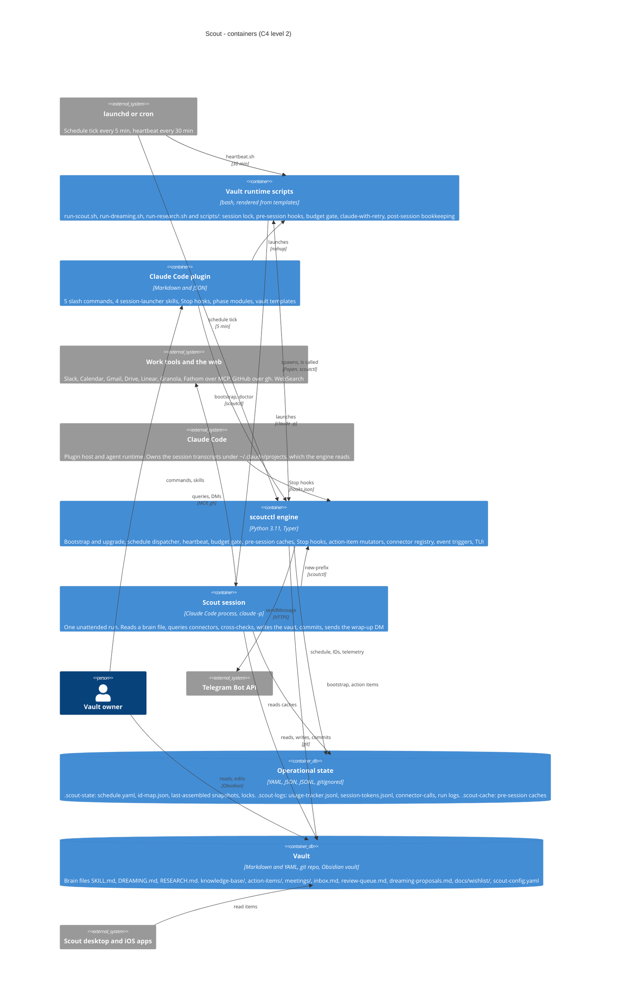

# Level 2 — Containers

The runnable and storable parts of Scout, and the calls between them.
Scout is unusual in that its "worker" is a Claude Code process it launches, and
its "application code" is mostly prompt markdown assembled into the vault. The
diagram draws both as containers because both are where the behaviour lives.
Blue boxes are Scout's containers; grey boxes are the systems around them.
Edge labels name the mechanism; the tables below carry the full call lists.

## The six containers

| Container | Where it lives | Technology | Owns |
|---|---|---|---|
| **Claude Code plugin** | `<plugin_root>/` (marketplace cache or a clone) | Markdown, JSON | `commands/`, `skills/`, `hooks/hooks.json`, `phases/`, `templates/`, `.claude-plugin/` |
| **scoutctl engine** | `<plugin_root>/engine/`, installed into `<plugin_root>/.venv` | Python 3.11, Typer, PyYAML, Jinja2, Rich, watchdog, requests; Textual optional | Everything under `engine/scout/` |
| **Vault runtime scripts** | `<vault>/run-*.sh`, `<vault>/scripts/`, `<vault>/hooks/` | bash, rendered from `templates/` | Session lock, pre-session hooks, budget gate, `claude` invocation, post-session bookkeeping |
| **Scout session** | A `claude -p` process with `cwd=<vault>` | Claude Code, Opus, `--permission-mode auto`, `--max-budget-usd` | One run of one session type; the only container that touches work tools |
| **Vault** | `<vault>` = `$SCOUT_DATA_DIR` or `~/Scout` | Markdown, YAML, git, Obsidian | Brain files, knowledge base, action items, meetings, inbox, review queue, proposals, wishlist, config |
| **Operational state** | `<vault>/.scout-state`, `.scout-logs`, `.scout-cache` | YAML, JSON, JSONL | Schedule, ID map, merge baselines, locks, telemetry, run logs, pre-session caches; all gitignored |

## Who calls the engine

`scoutctl` is one binary with five distinct callers, and the diagram's edges
into the engine are exactly those callers:

| Caller | Subcommands | Why |
|---|---|---|
| Slash commands | `bootstrap install`, `bootstrap upgrade`, `bootstrap doctor`, `self-update check`, `connectors probe-registry --json`, `version` | Setup, upgrade and status are conversations that shell out |
| launchd / cron | `schedule tick` | The dispatcher runs every 5 minutes regardless of sessions |
| Runtime scripts | `hook kb-pre-filter`, `pre-session data`, `session cc-cache`, `action-items materialize`, `budget check`, `action-items backfill-prefixes`, `heartbeat run` | Each `scripts/*.sh` wrapper is a thin shell around one engine command |
| Claude Code Stop hook | `hook session-tokens`, `hook session-tool-log` | Telemetry is computed once per session from the transcript, not per tool call |
| The session itself | `action-items new-prefix`, `notify telegram` | Stable IDs and Telegram are engine features the prompt can reach through Bash |

Edges left off the diagram to keep it legible, all real:

- The runtime scripts write run logs, the session lock and the pre-session
  caches into operational state directly (`write-session-cost.sh`,
  `rate-limit-detect.sh`, the lock block in each runner).
- The engine reads Claude Code transcripts under `~/.claude/projects` for the
  `cc-sessions` cache and the Stop hooks.
- `bootstrap` installs the LaunchAgents or the crontab block (`launchctl
  bootstrap`, `crontab`); `schedule install-wake-schedule` sets a `pmset` wake.
- `scoutctl self-update check` fetches the raw `marketplace.json` from the
  GitHub repo over HTTPS; it reports and never applies.
- The desktop app calls `scoutctl schedule fire-now`, `schedule list --json`,
  `action-items mark-done --by-id` and reads `engine/manifest.json`.

## Brain files: assembled, not referenced

The plugin's `phases/` are never read at run time. `scoutctl bootstrap` selects
the sections whose `requires:` connector is enabled and whose `mode:` matches
the target, renders the `{{VARS}}`, and writes three self-contained files into
the vault:

| Brain file | Sources | Used by |
|---|---|---|
| `SKILL.md` | `phases/core` + `phases/connectors` | Briefing and consolidation runs (`run-scout.sh`) |
| `DREAMING.md` | `phases/core` + `phases/modes` | Dreaming runs (`run-dreaming.sh`) |
| `RESEARCH.md` | `phases/core` + `phases/research` | Research runs (`run-research.sh`) |

A snapshot of each assembled file is kept in `.scout-state/last-assembled/` so
that an upgrade can three-way merge the freshly assembled text against the
owner's edited copy instead of overwriting it. The merge rules are in
[03-components.md](03-components.md#engine-cli-core-configuration-and-bootstrap).

## Session types and the vault files they touch

| Session | Runner | Brain file | Reads | Writes |
|---|---|---|---|---|
| Morning / weekend briefing | `run-scout.sh` | `SKILL.md` | inbox, meetings, KB, `.scout-cache`, all connectors | `action-items/action-items-YYYY-MM-DD.md`, meeting prep, KB, review queue; commit `briefing [HH:MM]:` |
| Consolidation (up to 4 per weekday) | `run-scout.sh` | `SKILL.md` | same, delta-scoped since the last run | updates the day's action items, KB, meeting synthesis; commit `consolidation [HH:MM]:` |
| Dreaming (evening, nightly, weekend morning) | `run-dreaming.sh` | `DREAMING.md` | Slack DM reactions and replies, mistake audit, proposals, wishlist, inline comment markers | mistake audit, proposals, direct brain-file edits, comment triage, digest; commit `dreaming [HH:MM]:` |
| Research (weekday afternoon, or heartbeat) | `run-research.sh` | `RESEARCH.md` | `knowledge-base/research-queue/*.md`, entity files, web, gh, Linear | entity files, relationships, research run log; commit `research [HH:MM]:` |
| Work (interactive) | none | none, `commands/scout-work.md` | today's action items, live connector state | checkbox flips, per-item commits `work [HH:MM]:` |
| Meta review (interactive) | none | none, `commands/scout-meta-review.md` | run logs, telemetry, mistake audit, proposals, all three brain files | `knowledge-base/meta-review-YYYY-MM-DD.md`, proposals; commit `meta-review [HH:MM]:` |
