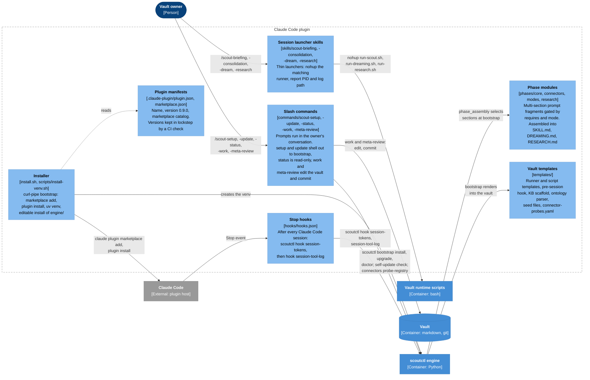
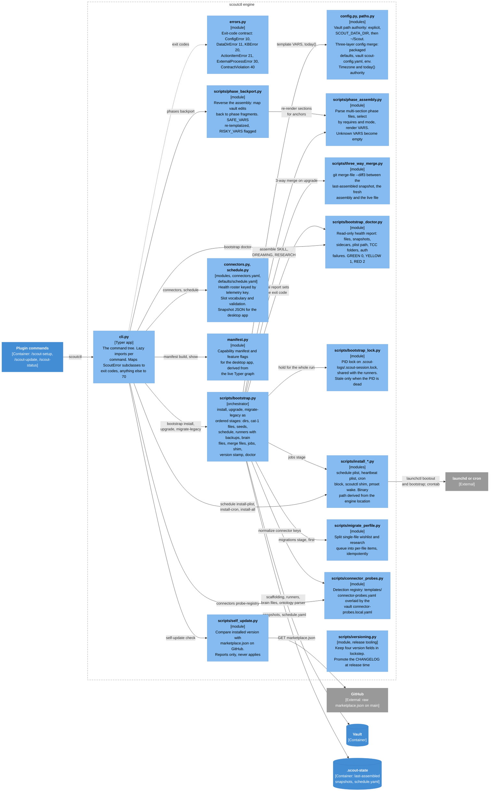
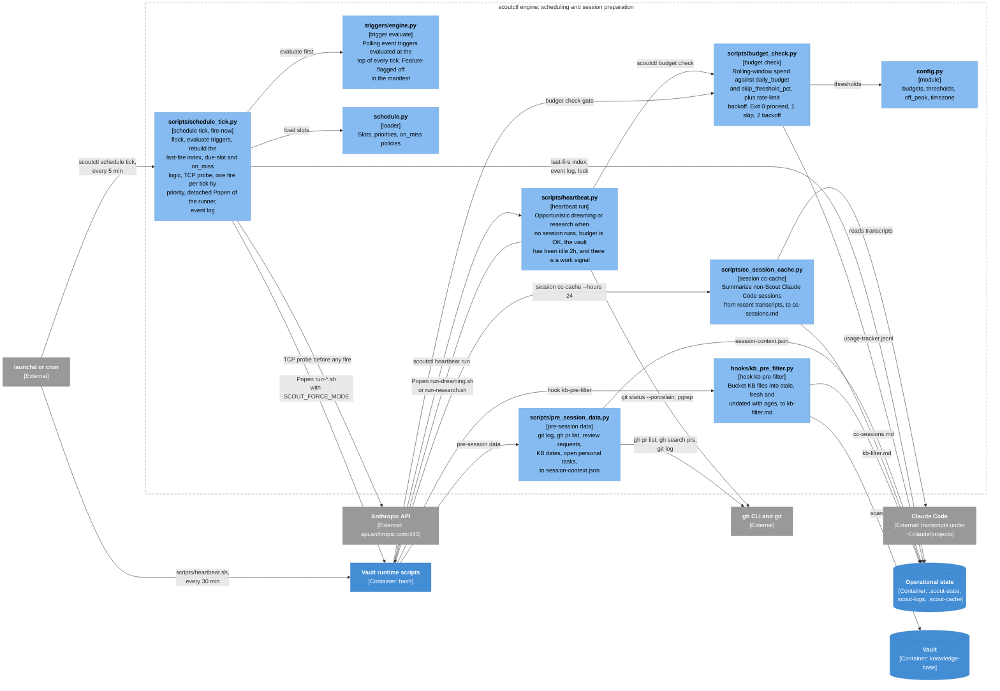
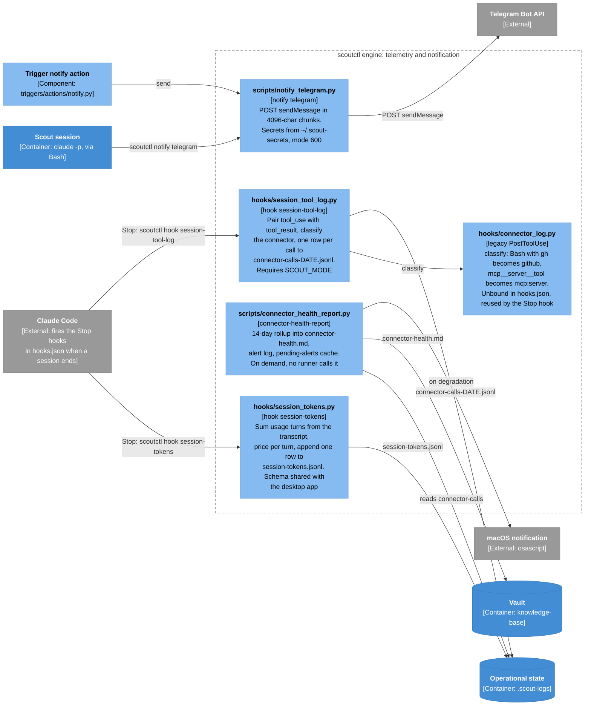
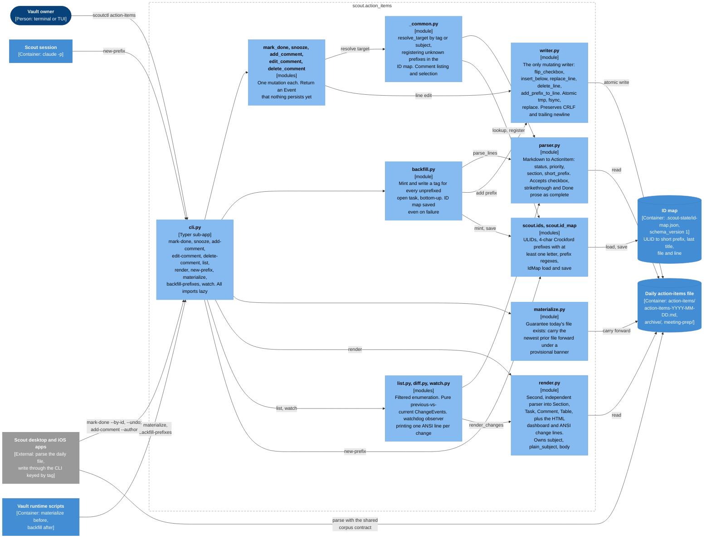
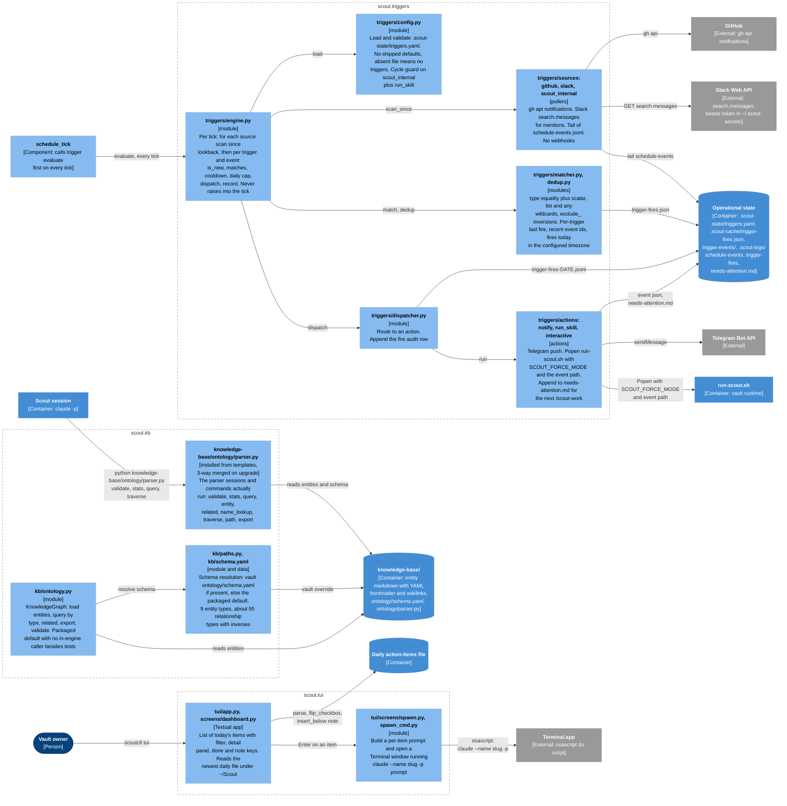
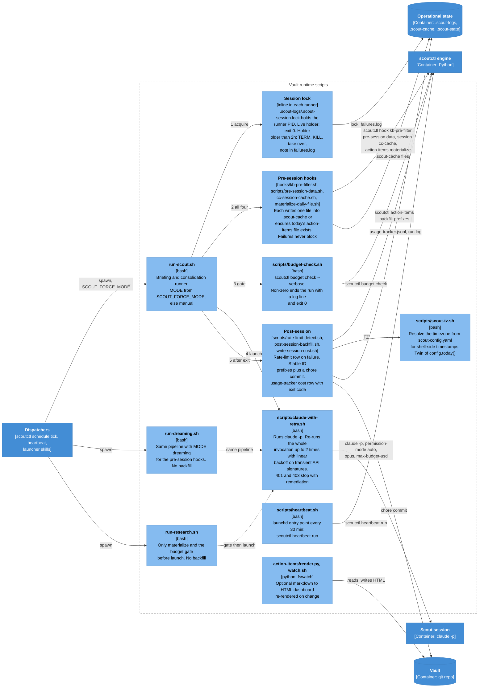

# Level 3 — Components

One diagram per container from [02-containers.md](02-containers.md). The
engine is large enough to split into four views by concern rather than one
diagram of forty modules.

These views use Mermaid flowcharts rather than the `C4Component` grid: with
twenty-odd edges per view the grid layout cannot route them legibly, while the
flowchart engine places and labels edges automatically. The colour code is the
same as the other levels: light blue for components, blue for other Scout
containers, grey for external systems, cylinders for stores. Each component
box reads name, then `[kind: file or module]`, then what it does. Diagrams
flow left to right: callers on the left, stores and external systems on the
right.

- [Claude Code plugin](#claude-code-plugin)
- [Engine: CLI core, configuration and bootstrap](#engine-cli-core-configuration-and-bootstrap)
- [Engine: scheduling, session preparation and telemetry](#engine-scheduling-session-preparation-and-telemetry)
- [Engine: action items](#engine-action-items)
- [Engine: knowledge graph, event triggers and TUI](#engine-knowledge-graph-event-triggers-and-tui)
- [Vault runtime scripts](#vault-runtime-scripts)

## Claude Code plugin

Everything Claude Code discovers from the repository layout. Nothing here runs
on its own: commands and skills are prompts executed in the owner's
conversation, the hooks are two shell commands, and `phases/` and `templates/`
are inputs to the engine's bootstrap.

Connector phases and their access mechanism, as encoded in `phases/connectors/`:

| Connector phase | Slots | Mechanism |
|---|---|---|
| `slack` | outbound-scan, inbound-scan, query, cross-check, update, notification | Slack MCP tools; the only outbound notification path in the prompts |
| `calendar` | outbound-scan, inbound-scan, query, cross-check, update | Google Calendar MCP |
| `email` | outbound-scan, inbound-scan, query | Gmail MCP; watermark file `.scout-cache/last-email-checked.txt` |
| `linear` | inbound-scan, query, cross-check, update, writeback | Linear MCP; the only phase that writes to a work tool |
| `github` | outbound-scan, inbound-scan, query, cross-check, update | `gh` CLI only, never a GitHub MCP |
| `granola`, `fathom` | inbound-scan, query | Meeting-transcript MCPs |
| `drive` | inbound-scan, query | Google Drive MCP |
| `claude-sessions` | outbound-scan | Local `~/.claude/projects/**/*.jsonl`, pre-cached by the engine |

## Engine: CLI core, configuration and bootstrap

The part of the engine that installs, upgrades and describes a Scout instance.
`bootstrap` is the orchestrator; everything else here is a service it uses or a
read-only view for the slash commands.

**Upgrade merge rules** (`_stage_cat4_upgrade`), per brain file, with
`base` = last-assembled snapshot, `ours` = fresh assembly, `theirs` = live file:

| Situation | Result |
|---|---|
| `ours == theirs` | Advance the snapshot only |
| `base == theirs` and `ours != theirs` | Write `<file>.md.proposed-merge`; live and snapshot untouched. Deliberately conservative after a fast-forward once wiped a customized vault |
| Both diverged, `git merge-file` clean | Write the merge to the live file; advance the snapshot |
| Both diverged, conflicts | Conflict-marked text to the sidecar; live and snapshot untouched |

Any pending sidecar blocks the next `bootstrap upgrade` until the owner resolves
it. The same policy protects `knowledge-base/ontology/parser.py`.

## Engine: scheduling, session preparation and telemetry

The part of the engine that decides when a session runs, prepares its inputs,
and measures what it did. Two diagrams: the first is everything that runs
*before* `claude` starts, the second is everything that runs *after* it exits.

Two registries describe connectors and they are easy to confuse:

| Registry | File | Keyed by | Used for |
|---|---|---|---|
| Detection | `templates/connector-probes.yaml` plus `<vault>/connector-probes.local.yaml` | connector name (`slack`, `github`, `email`) | `/scout-setup` probing: primary MCP tool or bash command, fallbacks, required user inputs |
| Health | `engine/scout/connectors.yaml` plus `.scout-state/connectors.local.yaml` | telemetry key (`mcp:claude_ai_Slack`, `github`, `notify:telegram`) | Alerting and remediation text; `required_in_types` per slot type; snapshot for the desktop app |

## Engine: action items

The daily markdown file is the database. Every mutation is a line edit made
through one atomic writer, every open task carries a stable `[#TAG]` prefix
registered in `.scout-state/id-map.json`, and the same file is parsed by the
engine, the TUI, the sessions and the companion apps.

Facts the diagram depends on:

- **Two parsers on purpose.** `parser.py` owns the fields the CLI needs to find
  and flip a line; `render.py` owns the fields a display needs. The
  cross-language contract test runs the golden corpus through both, because
  neither alone produces all four contract fields.
- **The corpus is the cross-repo contract.** `engine/tests/fixtures/contract/parser-corpus.json`
  pins `short_prefix`, `subject`, `plain_subject` and `body` for a set of raw
  task lines. Byte-identical copies are vendored in the macOS and iOS repos and
  guarded by SHA-256 on both sides. Change one, change all three.
- **Stable IDs exist for the companion apps.** `post-session-backfill.sh` runs
  `backfill-prefixes` after every `run-scout.sh` so that the apps' `--by-id`
  write path always has a structural key, then commits the daily file and the
  ID map together.
- **Archiving is prompt-driven.** Moving files older than seven days into
  `archive/` is instructed in `phases/core/action-items.md`; there is no engine
  code for it.

## Engine: knowledge graph, event triggers and TUI

Three smaller subsystems that share little code but all sit on the vault.

Facts the diagram depends on:

- **The vault parser is the one that runs.** Every command and phase that
  queries the graph shells out to `knowledge-base/ontology/parser.py` inside the
  vault. The packaged `scout.kb.ontology` is the default that bootstrap installs
  and tests exercise; there is no `scoutctl kb` sub-app. The vault copy is
  protected by the same three-way merge as the brain files so owner extensions
  such as `traverse` and `name_lookup` survive upgrades.
- **Triggers are wired but flagged.** `schedule_tick` evaluates triggers at the
  top of every tick, wrapped so a trigger failure can never break the schedule.
  The manifest still reports `triggers_v1: false`, and no default
  `triggers.yaml` ships, so a fresh install has no triggers until the owner
  writes the file. Only three sources exist (GitHub notifications, Slack
  mentions, Scout's own event log); Linear, Gmail and Calendar sources from the
  spec are not implemented.
- **The TUI writes around the CLI.** Done and note keys call `writer` directly,
  so those edits produce no `Event` and register nothing in the ID map. The TUI
  also hardcodes `~/Scout` rather than honoring `SCOUT_DATA_DIR`.

## Vault runtime scripts

Rendered from `templates/` into the vault at bootstrap and re-rendered on
upgrade (hand edits are backed up as `run-*.sh.bak.<date>`). Each `scripts/*.sh`
is a thin wrapper around one engine command; the runners sequence them. The
diagram follows `run-scout.sh` left to right; the other two runners share the
pipeline with the differences noted in their boxes. The numbered order of a run
is in [05-scheduled-run.md](05-scheduled-run.md).

