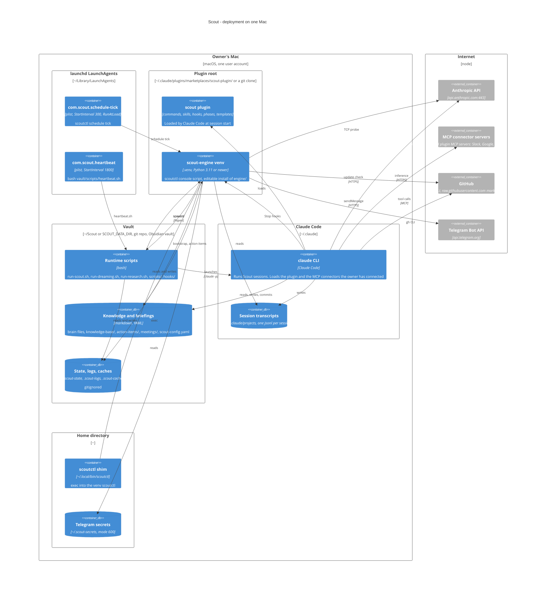

# Deployment view

Where each container actually sits on the owner's Mac, and which network
endpoints it reaches. Everything runs under one user account; there is no
server component. On Linux the two LaunchAgents become two lines in a managed
crontab block and the rest is unchanged.

## Install paths and the single source of truth

The engine works from any plugin root. Three layouts are supported and the
scheduler must run the same `scoutctl` the plugin loads:

| Layout | Plugin root |
|---|---|
| Marketplace install (`install.sh`, `/plugin install scout@scout-plugin`) | `~/.claude/plugins/marketplaces/<marketplace>/scout-plugin/` |
| Local plugins or dev tree (`claude --plugin-dir`) | any directory |
| Canonical clone | `~/scout-plugin/` |

`scoutctl schedule install-plist` and `install-cron` derive the scheduler's
binary from the running engine's own package location
(`Path(scout.__file__).parent.parent.parent / .venv/bin/scoutctl`). There is no
override knob, so the plist can never point at a different engine than the one
that wrote it. `bootstrap doctor` reads the installed plist back and flags RED
if the path is missing, not executable, or under a macOS TCC-protected folder
(`~/Documents`, `~/Desktop`, `~/Downloads`), where launchd would be denied.

## How the pieces get there

1. `install.sh` (curl-pipe) checks for `claude` and `git`, installs `uv` if
   needed, runs `claude plugin marketplace add Raven-Scout/scout-plugin` and
   `claude plugin install scout@scout-plugin`, finds the install path via
   `claude plugin list --json`, then runs `scripts/install-venv.sh` to create
   `<plugin_root>/.venv` and editable-install `engine/`.
2. `/scout-setup` probes connectors, collects user details and runs
   `scoutctl bootstrap install`, which creates the vault, renders the runtime
   scripts, assembles the brain files, seeds `.scout-state/schedule.yaml`,
   installs both LaunchAgents (or the cron block) and the `~/.local/bin` shim,
   and stamps the plugin version into `scout-config.yaml`.
3. `/scout-update` refreshes the plugin (git pull or marketplace update), then
   `scoutctl bootstrap upgrade` re-renders the scripts with backups, three-way
   merges the brain files, and re-installs the jobs idempotently.

Releases are cut by `scripts/release.sh` (version bump across four files,
changelog promotion, PR to `main`, then tag) and published by the
`release.yml` workflow, which attaches the changelog section to a GitHub
release. `scoutctl self-update check` compares the installed version against
the raw `marketplace.json` on `main`; it reports, it never applies.
