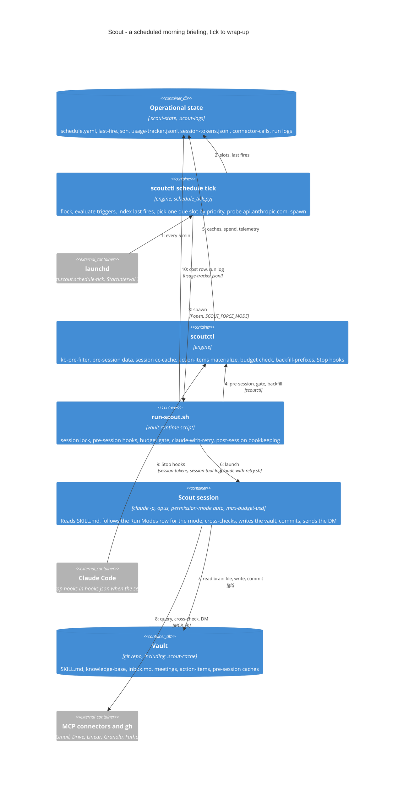

# Dynamic view — one scheduled run

What happens between a launchd tick and the wrap-up DM for a weekday morning
briefing. The same shape applies to consolidation, dreaming and research runs;
the differences are the runner script, the brain file and which pre-session
hooks run. Steps are numbered on the arrows; the notes below expand each one.

## Step notes

1. **Tick, not cron per slot.** launchd fires one job every 5 minutes. The
   dispatcher owns all slot logic: weekday match, `fires_at_local`,
   `missed_window_hours`, `on_miss` (`fire`, `collapse`, or the deprecated
   `skip`), `cooldown_minutes`, and one fire per tick ordered by slot type
   priority (briefing 50, consolidation 40, dreaming 30, research 20, manual 10).
   Losers are deferred to the next tick. Event triggers are evaluated first.
2. **The last-fire index is derived, not stored.** It is rebuilt from
   `usage-tracker.jsonl` and `session-tokens.jsonl` and cached in
   `.scout-state/last-fire.json`, keyed on their mtimes, so a fire is never
   double-counted and a missing cache is harmless.
3. **Offline means skip, not fail.** A 3-second TCP probe of
   `api.anthropic.com:443` (2 retries) precedes any spawn. If it fails the slot
   is skipped with `reason=network-offline` and nothing is recorded, so the slot
   stays eligible on the next tick. The runner is spawned detached with
   `SCOUT_FORCE_MODE` set to the slot key and `SCOUT_DATA_DIR` set to the vault,
   and the fire is recorded as a row in `usage-tracker.jsonl`.
4. **Pre-session hooks trade shell seconds for session tokens.** `run-scout.sh`
   runs `hook kb-pre-filter`, `pre-session data`, `session cc-cache --hours 24`
   and `action-items materialize`, each writing one file into `.scout-cache/`
   (or ensuring today's action-items file exists) that the brain file tells the
   session to read instead of re-deriving. Hooks never block a run; failures
   fall back to live queries. Then `budget check` decides whether to continue.
   After the session exits, the same edge carries `backfill-prefixes`.
5. **Budget is a gate, backoff is a memory.** `budget check` exits 1 when the
   rolling-window spend crosses `daily_budget × window/24 × skip_pct`, and 2
   when a `rate_limit` row or a non-zero exit sits inside the backoff window.
   Either non-zero result ends the runner with exit 0 and a log line.
6. **One `claude -p`, retried whole.** `claude-with-retry.sh` re-runs the entire
   invocation when the tail of the log matches a known transient signature
   (connection reset, stream idle timeout, 529 overloaded, lid-close sleep).
   401 and 403 stop immediately with remediation text. The prompt is a literal
   string: read `SKILL.md`, run mode `morning-briefing`, commit, send the DM.
7. **The session reads and writes the vault.** It reads the assembled brain
   file, the knowledge base, `inbox.md`, meetings and the `.scout-cache` files,
   then writes today's action items, KB updates, meeting prep and review-queue
   entries, and commits with the session type and time in the message.
8. **The session is the only container that talks to work tools.** It follows
   the Run Modes row for `MODE` and uses whatever MCP connectors Claude Code
   exposes plus the `gh` CLI; every candidate action item is cross-checked
   against a second source before it is written. The Slack DM goes last.
9. **Telemetry lands after the session exits.** The Stop hooks walk the
   transcript once: token usage and cost to `session-tokens.jsonl`, one row per
   tool call to `connector-calls-YYYY-MM-DD.jsonl`. The tool-call log requires
   `SCOUT_MODE` in the environment; the runners export `SCOUT_FORCE_MODE`, and
   closing that gap is tracked as issue #121.
10. **Post-session bookkeeping is deterministic.** `backfill-prefixes` gives
    every new action item a stable `[#XXXX]` prefix from
    `.scout-state/id-map.json` and commits it separately, so the companion apps
    can key on IDs. On a non-zero exit, `rate-limit-detect.sh` scans the log
    and may append a `rate_limit` row. The runner then appends its own
    `usage-tracker.jsonl` row (`source=runner`, exit code), which is what the
    next tick and the heartbeat read.

## The opportunistic path

The heartbeat (`com.scout.heartbeat`, every 30 minutes) is the second way a run
starts. `scoutctl heartbeat run` launches `run-research.sh` or `run-dreaming.sh`
only when all gates pass: no `claude` process named `scout-` is running, `budget
check` returns 0, at least 120 minutes since the last tracker row (240 in the
off-peak window), and there is a work signal, meaning 4 hours since the last
dreaming row or uncommitted changes in the vault. Research wins when the last
research run is over 24 hours old and `knowledge-base/research-queue/` has an
item with `status: open` or `in-progress`. The heartbeat does not set
`SCOUT_FORCE_MODE`, so these runs record as `dreaming-manual` or
`research-manual`.
